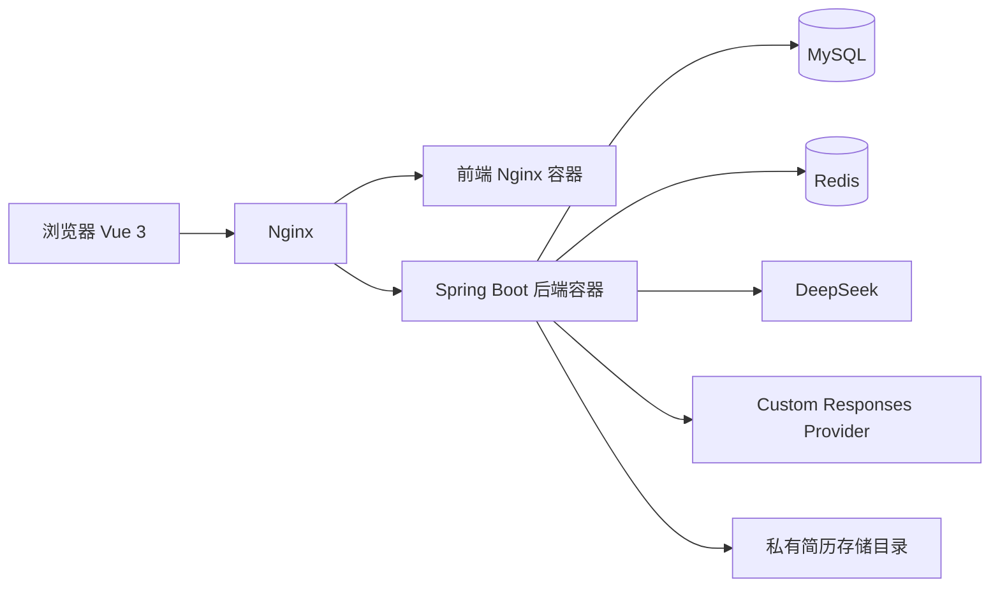

# AI 面试助手

一个面向技术求职者的 AI 面试训练平台。用户可以围绕技术知识点、知识库专题或自定义主题完成练习，获得 AI 评分与复盘；也可以上传简历，按岗位、公司风格和面试轮次进行模拟面试。

项目采用单仓库前后端分离结构，已完成 Docker 化并部署到腾讯云单机环境。项目中的密钥、数据库密码、JWT 密钥和简历原文件均不进入 Git。

## 核心能力

- 用户注册登录、Spring Security + JWT 鉴权与统一错误响应。
- 每个用户独立保存 AI 模型偏好：官方 DeepSeek 为默认模型，5.6 Terra 与 5.6 Luna 为可选中转模型。
- 三种出题模式：知识库专题出题、自定义知识点出题、按前后端方向和语言筛选的技术知识点出题。
- 知识库题目按用户、方向、语言和专题在 Redis 中保留近期历史，优先生成未出现过的题目。
- 单题生成、上一题/下一题浏览、SSE 流式评分、错题本和学习进度。
- PDF、DOCX、TXT 简历上传与私有预览；简历仅保存在服务端挂载目录，不公开原始文件 URL。
- 一次只出一题的模拟面试：支持初轮技术面、深入技术面、综合终面、HR 沟通面；支持每道主问题最多两次追问、目标公司风格模拟、语音转文字、提前结束与 AI 复盘报告。
- PDF、DOCX、TXT 简历上传上限为 10 MB；删除简历时保留已结束模拟面试的历史记录。
- Flyway 管理 MySQL 表结构迁移；Docker Compose 管理后端、前端、MySQL 和 Redis；宿主机 Nginx 提供访问入口；GitHub Actions 自动执行 CI，人工确认后执行生产 CD。

## 技术栈

| 范围       | 技术                                                                             |
| ---------- | -------------------------------------------------------------------------------- |
| 后端       | Java 17, Spring Boot 2.7, Maven, MyBatis-Plus                                    |
| 数据与缓存 | MySQL 8, Redis, Flyway                                                           |
| 安全       | Spring Security, JWT, BCrypt                                                     |
| AI 接入    | DeepSeek Chat Completions, OpenAI Responses-compatible custom provider           |
| 前端       | Vue 3, Vite, TypeScript, Pinia, Axios, Element Plus, Lucide                      |
| 测试与交付 | JUnit 5, Mockito, MockMvc, Vitest, GitHub Actions, Docker, Docker Compose, Nginx |

## 架构



后端保持 `Controller -> Service -> Mapper / AI Client` 的职责边界。AI 客户端由运行时模型目录路由，业务接口不接受前端传入的 API Key、模型代码或 Provider 名称。

详细设计见：

- [当前架构说明](docs/current-architecture.md)
- [部署与验收手册](docs/deployment-and-acceptance.md)
- [GitHub CI 与手动发布](docs/ci-cd.md)

## 仓库结构

```text
backend/     Spring Boot 后端、Flyway 迁移、Docker Compose、后端测试
frontend/    Vue 3 前端、Vitest 测试、Nginx 静态站点配置
docs/        架构、部署、前后端集成与项目说明
AGENTS.md    项目协作规则和当前实际进度
```

IDEA 打开 `backend/`，VS Code 打开 `frontend/`，Git 命令始终在仓库根目录执行。

## 本地运行

### 后端

准备 MySQL、Redis 与外部配置后，在 `backend/` 启动：

```powershell
Set-Location backend
.\mvnw.cmd spring-boot:run
```

本地 Docker 联调：

```bash
docker compose -f backend/docker-compose.yml up -d --build
```

后端默认监听 `http://localhost:8082`。首次对目标库启用 Flyway 前，必须确认该库允许执行项目内版本化迁移；已执行的迁移文件不得修改。

### 前端

```powershell
Set-Location frontend
pnpm install
pnpm dev
```

访问 `http://127.0.0.1:5173`。Vite 默认将 `/api` 代理到 `http://localhost:8082`。

## 外部配置

所有敏感值只能放在本地或服务器外部配置中。生产环境使用：

```text
/opt/ai-interview/config/.env
/opt/ai-interview/config/application-prod.properties
```

配置应包含数据库、Redis、JWT、DeepSeek 与 custom Provider 的必要参数。示例文件只保留占位符，绝不提交真实 Key。模型目录由数据库的 `ai_model` 和 `ai_model_policy` 管理，官方 DeepSeek 是当前默认模型。

## 质量检查

```powershell
Set-Location backend
.\mvnw.cmd '-Dspring.flyway.enabled=false' test

Set-Location ../frontend
pnpm lint
pnpm test:run
pnpm build
```

最近一次完整验证：GitHub Actions CI 在临时 MySQL 8、Redis 环境中通过后端 118 个测试；前端 ESLint、12 个 Vitest 测试与生产构建通过。

## 生产发布原则

1. 推送 `main` 后等待 GitHub Actions 的 Continuous Integration 通过。
2. 在 GitHub Actions 手动运行 Deploy Production 并确认发布。
3. 工作流自动备份 `interview_db`、校验提交版本、重建容器并检查前端 `200` 与后端 `401`。
4. Flyway 自动应用新迁移，禁止手工执行已纳入迁移的 SQL。
5. 发布后完成浏览器关键用户流程验收；仅在工作流不可用时使用部署手册的服务器命令排障。

完整命令与验收清单见 [部署与验收手册](docs/deployment-and-acceptance.md)。

## 已知边界

- 模拟公司面试仅是基于公开常见招聘侧重点的风格模拟，不能宣称拥有真实题库、真实内部流程或私有信息。
- AI 服务依赖外部 Provider，网络、配额或中转服务异常时会影响相应模型；DeepSeek 与 custom Provider 配置彼此独立。
- 当前部署为单机 Docker Compose，适合个人项目和中小流量验证；高可用、对象存储、异步队列与可观测性平台属于后续演进方向。
