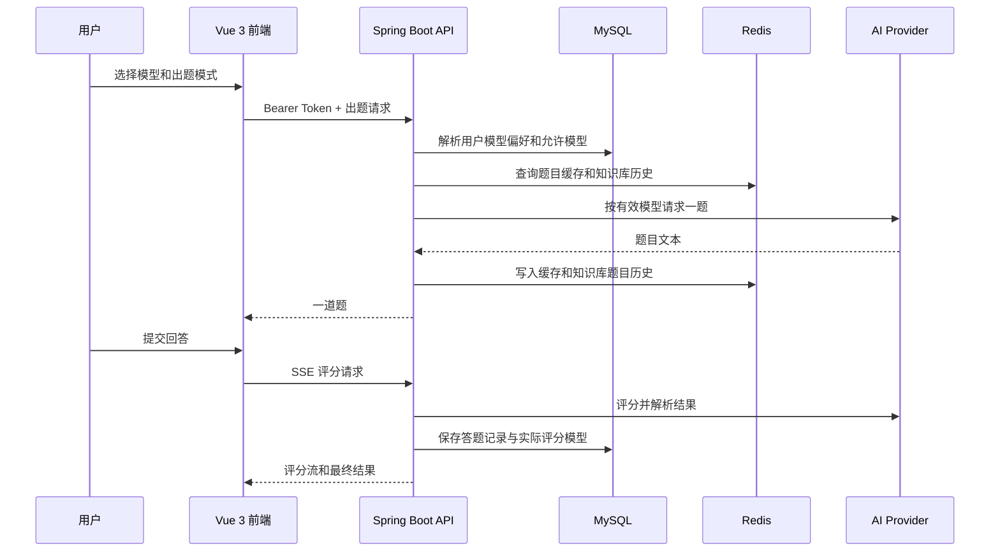

# 当前架构说明

本文描述仓库当前已实现的架构，而不是早期升级规划。

## 业务流程



## 后端分层

```text
controller/     HTTP 路由、DTO 校验、ApiResponse/SSE 适配
service/        出题、评分、知识库、简历、模拟面试等业务规则
client/         DeepSeek、custom Responses 协议与 AI 流式响应解析
mapper/         MyBatis-Plus 数据访问
entity/         表映射
security/       JWT 认证、SecurityContext 与 401/403 JSON 响应
config/         HTTP Client、线程池、应用配置
sse/            SseEmitter 生命周期与传输事件
```

关键边界：Controller 不直接访问 Mapper 或外部 AI；Service 不处理 HTTP/SSE 生命周期；API Key、端点和数据库密码均来自外部配置。

## AI 模型路由

- `ai_model` 是允许被用户选择的模型目录。
- `ai_model_policy` 保存系统默认模型，当前为官方 DeepSeek `deepseek-v4-flash`。
- `user_ai_preference` 仅保存用户选择的模型 ID，不保存 Provider 密钥。
- `AiClientRegistry` 在每次调用时按 Provider 与模型代码查找对应客户端。
- 目录接口仅返回已启用且外部配置完整的模型；中转配置缺失不会影响 DeepSeek。

## 出题模式

| 模式 | 数据来源 | 约束 |
| --- | --- | --- |
| 知识库专题 | 已发布的知识库文档 | 必须匹配方向和语言，只依据文档出题 |
| 自定义知识点 | 用户文本 | 不读取知识库 |
| 技术知识点 | 后端允许列表 | 必须匹配选择的方向和语言 |

知识库模式会将近期题目按用户、方向、语言和专题保存在 Redis 中。提示词要求优先生成未出现过的题目；若模型仍重复，后端会重试一次。

## 简历与模拟面试

- 上传仅接受 PDF、DOCX、TXT，文件大小上限为 2 MB。
- 原始文件存入后端私有挂载目录，数据库保存元数据、存储路径和提取后的文本。
- 预览接口按当前用户和简历 ID 做所有权查询，只返回提取文本与文件元数据，不暴露存储路径或公开下载地址。
- 模拟面试会冻结会话创建时的有效模型，支持初轮技术面、深入技术面、综合终面及可选目标公司风格。
- 每次只生成一个问题，逐题保存回答、评分、参考要点和建议，结束时生成汇总报告。

## 数据与发布

- MySQL 核心数据：用户、答题记录、AI 模型目录、知识库、简历、模拟面试会话及轮次。
- Redis：题目缓存与可重建的知识库题目历史。
- Flyway：V1 至 V9 均为版本化迁移。已在环境执行的迁移不可修改。
- Docker Compose：MySQL、Redis、Spring Boot 后端和 Vue/Nginx 前端均容器化运行。
- 宿主机 Nginx 负责公网入口和 TLS；容器端口绑定到 `127.0.0.1`，不直接暴露数据库或后端服务。
